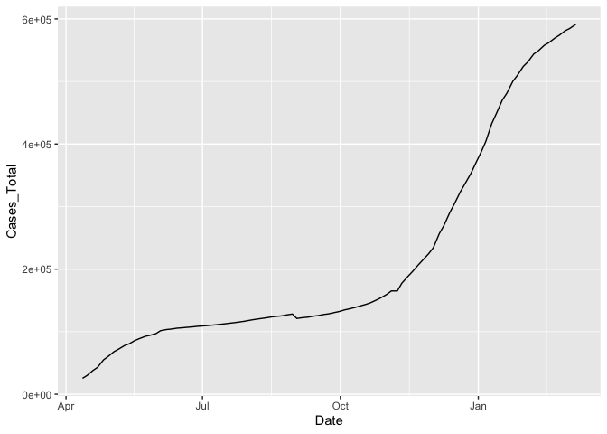

Week 03 `dplyr` Activity
================
Wenting Chen

Today, we’ll be working with a data set related to COVID. This data is
based on data from the the [COVID Tracking
Project](https://covidtracking.com/). I cleaned up this data and also
added total populations from the 2020 for each of the relevant
categories. Note, due to differences in the way race and ethnicity are
encoded in the census as compared to the the COVID Tracking Project, the
population counts for LatinX may be somewhat inaccurate.

``` r
library(tidyverse)
```

    ── Attaching core tidyverse packages ──────────────────────── tidyverse 2.0.0 ──
    ✔ dplyr     1.1.3     ✔ readr     2.1.4
    ✔ forcats   1.0.0     ✔ stringr   1.5.0
    ✔ ggplot2   3.4.3     ✔ tibble    3.2.1
    ✔ lubridate 1.9.2     ✔ tidyr     1.3.0
    ✔ purrr     1.0.2     
    ── Conflicts ────────────────────────────────────────── tidyverse_conflicts() ──
    ✖ dplyr::filter() masks stats::filter()
    ✖ dplyr::lag()    masks stats::lag()
    ℹ Use the conflicted package (<http://conflicted.r-lib.org/>) to force all conflicts to become errors

``` r
load("CRDT Data.RData")
```

I’ve include 4 different data sets. They all have the same data but have
it represented in different ways. Try using the different data sets and
see which ones are good for making which plots.

``` r
ggplot(covid_data_count, aes(x = date, y = Cases)) + geom_point()
```

    Warning: Removed 1385 rows containing missing values (`geom_point()`).


``` r
ggplot(covid_data_long, aes(x = date, y = count)) + geom_point()
```


``` r
ggplot(covid_data_orig, aes(x = Date, y = Cases_Total)) + geom_point()
```

    Warning: Removed 232 rows containing missing values (`geom_point()`).


``` r
ggplot(covid_data_race, aes(x = date, y = Total_count)) + geom_point()
```

    Warning: Removed 2 rows containing missing values (`geom_point()`).


If you want to only look at a specific state, you can do it like this.
For now, see what you can do just using `ggplot`.

``` r
covid_data_count |> 
  filter(state == "MA") |> 
  ggplot(aes(x = date, y = Cases, color = race)) + geom_line()
```


``` r
covid_data_long |> 
  filter(state == "MA") |> 
  ggplot(aes(x = date, y = count, color = race)) + geom_line()
```


``` r
covid_data_orig |> 
  filter(State == "MA") |> 
  ggplot(aes(x = Date, y = Cases_Total)) + geom_line()
```



``` r
covid_data_race |> 
  filter(state == "MA") |> 
  ggplot(aes(x = date, y = Total_count, color = count_type)) + geom_line()
```


1.  Write code for a plot and describe what you observe? According to
    the first data set count, we can observe that the number of cases is
    on the rise, with the number of Latinx rising the fastest. Each
    region has the largest number of white people. In the second data
    set, the combined number of various types also shows an upward
    trend. Among them, the majority of races are white. The third data
    set leads to the same conclusion as the first data set. The fourth
    data set leads to the same conclusion as the second data set.
2.  Are there any conclusions you can draw? Based on the plots drawn
    from the four data sets, I can draw the following conclusions. From
    April 2020 to March 2021, the number of cases is on the rise, and
    more and more people are getting COVID.
3.  What were you not able to do due to not having the R knowledge?
    Without R, I would not be able to visualize the data and draw
    conclusions clearly and easily.
4.  What other data would be useful to better understand this data? For
    example, cumulative recovery data, population health disparity data,
    and tourist number data in each state.
